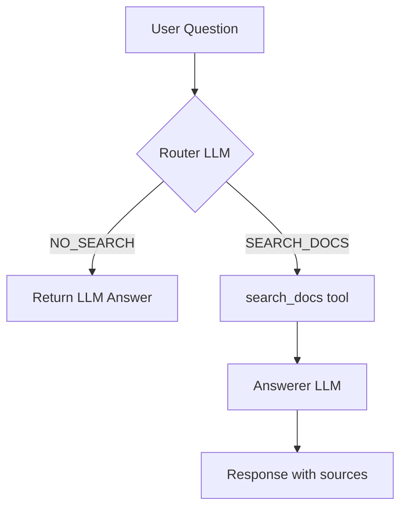

# Personal Memory Agent

A minimal AI agent implementation for learning purposes. No frameworks, no magic — just pure Python showing what's under the hood of tools like LangChain, ADK, Koog, etc.

The agent combines LLM's general knowledge with your personal documents (travel journal). It decides when to answer directly vs. when to search your private data.

## What This Project Teaches

This is **Lesson 1** in understanding AI agents. It demonstrates the core **Agent Loop** pattern:



## How It Works

1. **User asks a question**
2. **Router LLM decides:**
   - `SEARCH_DOCS` → search the knowledge base
   - `NO_SEARCH` → answer from general knowledge
3. **If searching:** run naive keyword search over `docs/` folder
4. **Answerer LLM** generates response using retrieved context

## Project Structure

```
.
├── agent.py              # Starter template (we'll build this together!)
├── finished/
│   └── agent.py          # Complete solution (peek here if stuck)
├── config.json           # Your API credentials (create from template)
├── config.example.json   # Template for config
├── requirements.txt      # Python dependencies
├── docs/
│   └── travel_journal.txt   # Sample knowledge base
└── README.md
```

> **Workshop note:** The main `agent.py` has the core function `agent_once()` as a stub. 
> During the session, we'll implement it step by step. 
> The complete working version is in `finished/agent.py` — use it as a reference anytime!

## Quick Start

### 1. Install dependencies

```bash
pip install -r requirements.txt
```

### 2. Configure API credentials

Copy the example config and add your API key:

```bash
cp config.example.json config.json
```

Edit `config.json`:

```json
{
  "api_key": "your-api-key-here",
  "base_url": "https://api.openai.com/v1",
  "model": "gpt-4o-mini"
}
```

Works with any OpenAI-compatible API (OpenAI, OpenRouter, Ollama, etc.)

### 3. Run the agent

```bash
python agent.py
```

## Example Questions

Try asking:

- **Personal (triggers search):** "What cities have I visited?" or "When did I go to Lisbon?"
- **General (no search):** "What is the capital of France?" or "How do airplanes fly?"

## Sample Output

```
You: When did I visit Helsinki?

[router decision] {'action': 'SEARCH_DOCS', 'query': 'Helsinki visit date'}
[tool call] search_docs(query='Helsinki visit date')
[tool result]
[source=travel_journal.txt score=2] In September 2024 I found a small coffee shop...

Agent: You visited Helsinki in September 2024, where you discovered a cozy 
coffee shop called Kaffa Roasters (travel_journal.txt).
```

## Key Concepts Demonstrated

| Concept | Where in Code |
|---------|---------------|
| **Agent Loop** | `agent_once()` function |
| **Tool Routing** | `ROUTER_SYSTEM_PROMPT` |
| **Tool Execution** | `search_docs()` |
| **RAG (basic)** | `load_doc_chunks()` + keyword matching |
| **LLM Abstraction** | `chat()` function |

## Limitations (By Design)

This is a **learning project**, intentionally simple:

- ❌ No conversation memory (each question is independent)
- ❌ No embeddings (uses keyword matching, not semantic search)
- ❌ Single tool only (real agents have multiple tools)
- ❌ No streaming (waits for full response)
- ❌ No retry logic (fails on first API error)

## License

MIT — use freely for learning!
